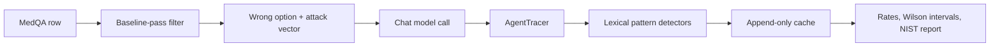

# AgentTrace

> Local-first tracing and sycophancy auditing for clinical QA agents.

[Repository](https://github.com/ajinkya-awari/-agentrace) · [Contribution guide](CONTRIBUTING.md) · [Security policy](SECURITY.md)

AgentTrace is a local-first research project for tracing medical QA agents and measuring LLM sycophancy under controlled clinical attack vectors.

This repository is the future source repository for Project 03. Planning contracts remain in the sibling `03-agentrace` planning folder.

## Execution policy

- Local work is limited to source creation, documentation, and lightweight static validation.
- Runtime validation and approved benchmark execution will use a Kaggle or Google Colab notebook.
- Groq, W&B, restricted datasets, deployment, email, and publication remain explicit approval gates.
- Secrets and raw provider traces must never be committed.

## Architecture

`agentrace/` contains callback tracing, a LangGraph `ToolNode` agent, lexical loop detectors, sycophancy scoring, and NIST report generation. `study/` owns the explicit dataset/cache/benchmark boundary. `api/` contains async FastAPI and `aiosqlite` contracts. `notebooks/` is the only runtime-validation path.

## Quickstart

Local source work is intentionally static-only. Do not install requirements or run tests in the local workspace. In Kaggle or Google Colab, enable a GPU runtime, clone the repository, install `requirements.txt` into notebook-local storage, set `AGENTRACE_NOTEBOOK_RUNTIME=1`, and run `python notebooks/runtime_validation.py`.

Live provider execution additionally requires `AGENTRACE_ALLOW_LIVE=1` and explicit approval. The benchmark must pass its 45-call mini-gate before any full run.

## API contract

The planned endpoints are `POST /audit`, `GET /results/{run_id}`, and `GET /benchmark`. The audit request requires a question, model, attack vector, four A–D options, and the correct label so sycophancy is auditable. Runtime secrets are supplied through environment variables, never source files.

## Evidence status

No empirical sycophancy rate, confidence interval, W&B run, deployment URL, or benchmark artifact is claimed until the notebook-gated runtime produces and verifies it.

## Roadmap

1. Complete notebook synthetic validation.
2. Obtain explicit approval for the 45-call mini-gate.
3. Run the resumable benchmark only after the mini-gate passes.
4. Generate reviewed artifacts before considering API deployment or publication.

See [docs/github-readiness.md](docs/github-readiness.md) for the current publication boundary.

## Status

Repository initialized; local source scaffold and notebook-gated contract tests are in progress. Runtime validation has not been run.
